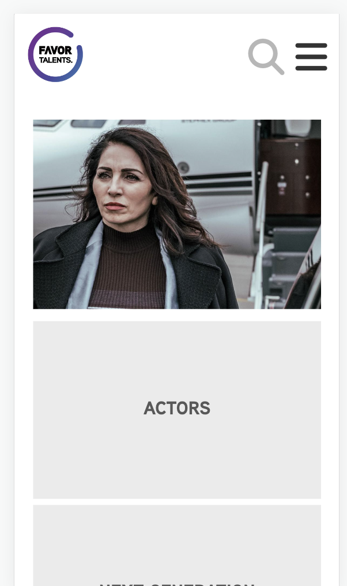
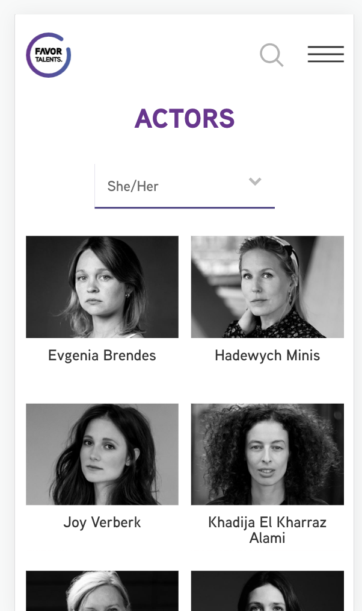

# Procesverslag

Markdown is een simpele manier om HTML te schrijven.  
Markdown cheat cheet: [Hulp bij het schrijven van Markdown](https://github.com/adam-p/markdown-here/wiki/Markdown-Cheatsheet).

Nb. De standaardstructuur en de spartaanse opmaak van de README.md zijn helemaal prima. Het gaat om de inhoud van je procesverslag. Besteedt de tijd voor pracht en praal aan je website.

Nb. Door _open_ toe te voegen aan een _details_ element kun je deze standaard open zetten. Fijn om dat steeds voor de relevante stuk(ken) te doen.

## Jij

  
### Auteur:

Sasja van Beek

#### Je startniveau:

Blauw

#### Je focus:

Surface Plane:

- Video/Geluid
- Dark/Light mode
- Prefers-reduced-motion
- Advanced positioning: sticky, fixed, z-index…
- Toegankelijkheid++
- Drop-down menu

## Je website

### Je opdracht:

Het semantisch namaken van de website van het management Favor Talents:
https://www.favortalents.com/

#### Screenshot(s) van de eerste pagina (small screen):

Homescreen

#### Screenshot(s) van de tweede pagina (small screen):

Overzicht van acteurs

## Toegankelijkheidstest 1/2 (week 1)

### Bevindingen

Na het testen van de toegankelijkheid van de website heb ik de volgende dingen aan de website opgemerkt.

Tijdens het testen van de toegankelijkheid van de website: ‘https://www.favortalents.com/’ ben ik erachter gekomen dat deze website niet toegankelijk is voor mensen met een beperking.

#### Screenreader

- De header wordt niet opgemerkt door de screenreader, zo weten blinde mensen dus niet dat er een logo, zoek-icon en hamburger menu staat.
- De afbeeldingen bevatten geen alt-tekst en zo weten blinden dus niet dat er een afbeelding staat en wat er op deze afbeelding te zien is.
- De linkjes in de unordered list bevatten ook geen alt-tekst. De screen reader laat blinden mensen dus alleen weten dat er een link is maar niet waar de gebruiker uit zal komen als hij of zij op de link klikt.
- De paragrafen worden wel goed voorgelezen door de screenreader. Alle tekst is per zin in een paragraaf gezet.
- De social media icons worden goed voorgelezen door de screenreader.

---

- De filteropties worden goed voorgelezen door de screenreader.
  De linkjes met daarin een afbeelding en een h3 worden niet opgemerkt door de screenreader.

Hier een omschrijving van hoe het opgelost kan worden (met indien nodig afbeeldingen)

- Er moet altijd worden toegevoegd bij het logo, zoek-icon en hamburgermenu en ook bij de afbeeldingen en linkjes.
- Er moet per link worden aangegeven wat er op de afbeelding is te zien en welke tekst er onder de afbeelding staat zodat de gebruiker weet waar hij of zij naartoe gaat als hij of zij op de link klikt.

#### Muis en Toetsenbord

- Alles is met de muis te navigeren.
- De website is niet toegankelijk voor toetsenborden, er gebeurt simpelweg niet als er op de tab wordt gedrukt.
- Ook zijn er geen steeds uitgewerkt.

- Een oplossing hiervoor zou zijn om alles netjes semantisch precies te labelen en te nesten.

#### Motoriek (shocks, elastiekjes)

- De vlak verdeling op de website is groot en dit maakt het toegankelijk voor mensen met een beperking in hun motoriek. als er bijvoorbeeld makkelijk uitschieten is het vlak zo groot dat en klik verder op In het scherm dezelfde functie heeft.

#### Visueel (brillen, contrast, kleurenblind, dark/light).

De letters zijn groot genoeg om te kunnen lezen, behalve in de footer. Deze informatie is ook minder belangrijk, toch is dit niet toegankelijk. Contrast is goed genoeg. KLeuren zijn minder duidelijk maar dit zit de functionaliteit van de website gelukkig niet in de weg. Zelfs de hover functie is nog duidelijk genoeg om waar te nemen.

- De site is niet goed te lezen in hoog contrast.
- De site bevat geen dark modus.
- Dus bevat geen kleurenblind opties.

- Dit kan worden opgelost door een visueel beperkt toegankelijke website bouwen. een goed begin is om een dark-modus versie uit te werken.

## Breakdownschets (week 1)

### de hele pagina:

  

### dynamisch deel (bijv menu):

  

### wellicht nog een dynamisch deel (bijv filter):

  

## Voortgang 1 (week 2)

### Stand van zaken

De eerste week is het me gelukt om de HTML pagina's af te krijgen. In het begin van de tweede week, nu dus, Ben ik nog hard aan het werk met het afmaken van de opmaak van de site, de CSS dus. Ook wil ik deze week een plan maken voor mijn JavaScript.

## Voortgang 2 (week 3)

### Stand van zaken

Omdat mijn twee pagina's verschillende styling hebben heb ik goedkeuring gevraagd om twee stylesheets te maken. Hieraan was ik begonnen maar later heb ik te horen gekregen dat het toch semantischer is om één stylesheet te maken en dan Classes toe te voegen aan de dingen die verschillen. Het kostte wat tijd om dit terug te zetten en op te lossen. Verder ben ik begonnen aan het stijlen van mijn hamburger menu. Ook moest ik er nog voor zorgen dat alle afbeeldingen in dit verslag weergegeven worden. Uiteindelijk kwam ik er achter dat ik de afbeeldingen niet goed had aangesproken en dat ze daardoor dus niet werkte.

## Toegankelijkheidstest 2/2 (week 4)

### Bevindingen

In de werkgroep hebben we verschillende testen uitgevoerd op het gebied van toegankelijkheid. Hieronder zijn mijn bevindingen te zien.

#### Concentratie

Of het nog steeds goed mogelijk is om de website te navigeren met een concentratie probleem heb ik de website getest terwijl ik een ballon aan het hooghouden was.
Na het testen van de website en het hooghouden van een ballon ben ik erachter gekomen dat je nog goed door de webite heen kunt komen omdat er weinig opties per pagina zijn. Er is maar 1 actie de focus en het doel wordt snel en makkelijk bereikt door weinig informatie.

#### Screenreader

Bij de originele website ontbreken veel alt teksten en hierdoor is het voor een screen reader heel lastig om door de website heen te komen. In mijn website heb ik daar wel rekening mee gehouden dus werkt het beter.

#### Muis en Toetsenbord

De site is het makkelijkste besturen door middel van een muis.

#### Motoriek (shocks, elastiekjes)

Om te testen of de site goed te navigeren is voor mensen met een motorische beperking heb ik elastiekjes om mijn vinger gewonnen terwijl ik door de site heen ging.
De site blijkt goed navigeer baar voor mensen met een motorische beperking omdat er een grote klikbaar ruimte om de buiten zit en omdat er weinig Gestures worden verwacht van de gebruiker. Eigenlijk wordt alleen Swipen en Tappen verwacht, dit is goed te doen met elastiekjes om je vingers. Wel zijn de buttons op de site erg klein maar nog steeds in deze toegankelijk omdat ze nog steeds werken als je mis klikt.

Verder heb ik ook geprobeerd om de website met een schok apparaat te testen. Tijdens het testen krijg ik zo'n gek gevoel in mijn arm waardoor ik schrok en de test niet heb afgemaakt. Wel ben ik er achtergekomen dat überhaupt een telefoon vasthouden en dan nog navigeren door een website eigenlijk onmogelijk is. De grote oppervlak dat klikbaar is maakt het nog toegankelijk maar de leesbaarheid van de website gaat heel erg achteruit als je hand trilt. Op een laptop zou de website misschien nog te doen zijn.

#### Visueel (brillen, contrast, kleurenblind, dark/light).

In de werkgroep hadden we toegang tot verschillende brillen die een visuele beperking demonstreerden. Uit mijn thuis blijkt dat het contrast van de website hoog genoeg is en dat de letters groot genoeg zijn om te kunnen lezen met visuele beperkingen zoals deze brillen vertonen.

## Voortgang 3 (week 4)

### Stand van zaken

In de laatste week ben ik bezig gegaan met het uitwerken van mijn microinteractie door middel van JavaScript. Ook ben ik bezig gegaan met het toepassen van Surface Plane in mijn website.

## Eindgesprek (week 5)

### Je uitkomst - karakteristiek screenshots:

### Dit ging goed/Heb ik geleerd:

Aan dit vak heb ik veel gehad zodat ik mijn kennis van HTML CSS en Javascript weer heb opgefrist. Ik herinnerde me meer dan ik dacht en hier ben ik trots op. Door het namaken van een bestaande website leer je open andere manier naar website kijken. Het zijn semantisch herschrijven van de website is erg leerzaam geweest. Ik werd altijd een beetje bang van code maar ik ben blij dat ik een website heb gekozen die voor mij haalbaar was om na te maken.

### Dit was lastig/Is niet gelukt:

Ik vond het lastig om te googelen wat ik precies nodig had omdat ik bepaalde kennis niet heb. Ik begreep vaak de code wel maar niet hoe ik dit moest toepassen in mijn eigen website. Hierdoor heb ik veel hulp gevraagd aan studenten assistenten en dit heeft me erg geholpen.

## Bronnenlijst

1. https://codepen.io/shooft/pen/BaKGKwm
2. https://codepen.io/shooft/details/BaKGKwm
   De bovenstaande site is het stukje code van Sanne. Dit gaat over het werkend maken van de hamburger menu. Om dit te begrijpen heb ik ook hulp gehad van de student-assistent.
3. https://www.favortalents.com/
4. https://www.favortalents.com/actors
   De bovenstaande bronnen zijn de twee pagina's van de orginele site die ik heb nagemaakt in deze opdracht.
5. https://fontawesome.com/
   Het zoek icon en het menu icon komt van de bovenstaande bron.

