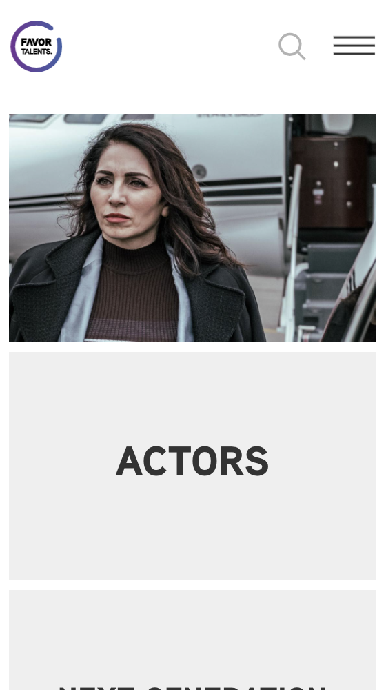
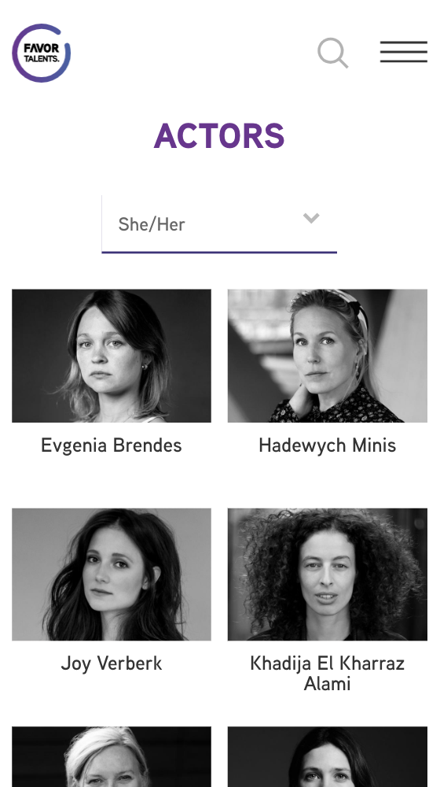
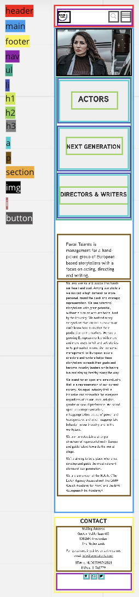
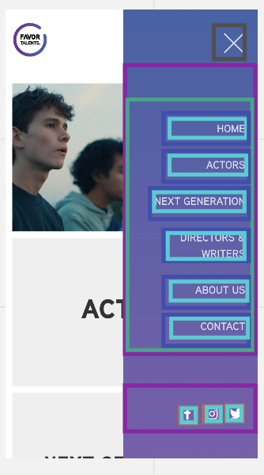
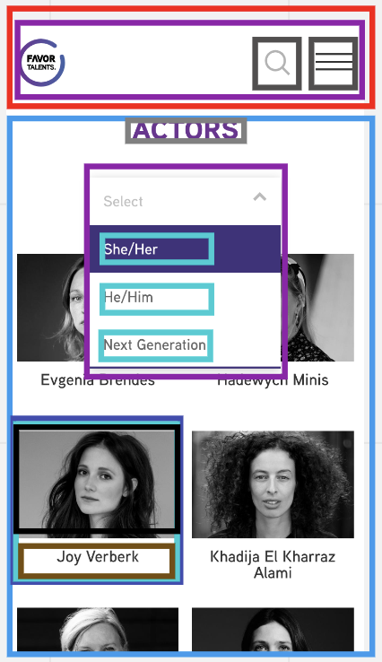

# Procesverslag

Markdown is een simpele manier om HTML te schrijven.  
Markdown cheat cheet: [Hulp bij het schrijven van Markdown](https://github.com/adam-p/markdown-here/wiki/Markdown-Cheatsheet).

Nb. De standaardstructuur en de spartaanse opmaak van de README.md zijn helemaal prima. Het gaat om de inhoud van je procesverslag. Besteedt de tijd voor pracht en praal aan je website.

Nb. Door _open_ toe te voegen aan een _details_ element kun je deze standaard open zetten. Fijn om dat steeds voor de relevante stuk(ken) te doen.

## Jij

  
uitwerken voor kick-off werkgroep

### Auteur:

Sasja van Beek

#### Je startniveau:

blauw

#### Je focus:

service plane

## Je website

  
uitwerken voor kick-off werkgroep

### Je opdracht:

https://www.favortalents.com/
Website van het management Favor Talents

#### Screenshot(s) van de eerste pagina (small screen):

Homescreen

#### Screenshot(s) van de tweede pagina (small screen):

Overzicht van acteurs

## Toegankelijkheidstest 1/2 (week 1)

  
uitwerken na test in 1e werkgroep

### Bevindingen

Lijst met je bevindingen die in de test naar voren kwamen:

Tijdens het testen van de toegankelijkheid van de website: ‘https://www.favortalents.com/’ ben ik erachter gekomen dat deze website niet toegankelijk is voor mensen met een beperking.

#### Screenreader

Hier korte omschrijving (met indien nodig afbeeldingen)

- De header wordt niet opgemerkt door de screenreader, zo weten blinde mensen dus niet dat er een logo, zoek-icon en hamburger menu staat.
- De afbeeldingen bevatten geen alt-tekst en zo weten blinden dus niet dat er een afbeelding staat en wat er op deze afbeelding te zien is.
- De linkjes in de unordered list bevatten ook geen alt-tekst. De screen reader laat blinden mensen dus alleen weten dat er een link is maar niet waar de gebruiker uit zal komen als hij of zij op de link klikt.
- De paragrafen worden wel goed voorgelezen door de screenreader. Alle tekst is per zin in een paragraaf gezet.
- De social media icons worden goed voorgelezen door de screenreader.

---

- De filteropties worden goed voorgelezen door de screenreader.
  De linkjes met daarin een afbeelding en een h3 worden niet opgemerkt door de screenreader.

Hier een omschrijving van hoe het opgelost kan worden (met indien nodig afbeeldingen)

- Er moet altijd worden toegevoegd bij het logo, zoek-icon en hamburgermenu en ook bij de afbeeldingen en linkjes.
- Er moet per link worden aangegeven wat er op de afbeelding is te zien en welke tekst er onder de afbeelding staat zodat de gebruiker weet waar hij of zij naartoe gaat als hij of zij op de link klikt.

#### Muis en Toetsenbord

Hier korte omschrijving (met indien nodig afbeeldingen)

- Alles is met de muis te navigeren.
- De website is niet toegankelijk voor toetsenborden, er gebeurt simpelweg niet als er op de tab wordt gedrukt.
- Ook zijn er geen steeds uitgewerkt.

Hier een omschrijving van hoe het opgelost kan worden (met indien nodig afbeeldingen)

- Een oplossing hiervoor zou zijn om alles netjes semantisch precies te labelen en te nesten.

#### Motoriek (shocks, elastiekjes)

Hier korte omschrijving (met indien nodig afbeeldingen)

- De vlak verdeling op de website is groot en dit maakt het toegankelijk voor mensen met een beperking in hun motoriek. als er bijvoorbeeld makkelijk uitschieten is het vlak zo groot dat en klik verder op In het scherm dezelfde functie heeft.

Hier een omschrijving van hoe het opgelost kan worden (met indien nodig afbeeldingen)

#### Visueel (brillen, contrast, kleurenblind, dark/light).

Hier korte omschrijving (met indien nodig afbeeldingen)

- De site is niet goed te lezen in hoog contrast.
- De site bevat geen dark modus.
- Dus bevat geen kleurenblind opties.

Hier een omschrijving van hoe het opgelost kan worden (met indien nodig afbeeldingen)

- Dit kan worden opgelost door een visueel beperkt toegankelijke website bouwen. een goed begin is om een dark-modus versie uit te werken.

## Breakdownschets (week 1)

  
uitwerken na afloop 2e werkgroep

### de hele pagina:

  

### dynamisch deel (bijv menu):

  

### wellicht nog een dynamisch deel (bijv filter):

  

## Voortgang 1 (week 2)

  
uitwerken voor 1e voortgang

### Stand van zaken

css progress, 2 css? javascript nog vragen
hier dit ging goed & dit was lastig (neem ook screenshots op van delen van je website en code)

### Agenda voor meeting

samen met je groepje opstellen

| student 1      | student 2          | student 3    | student 4        |
| -------------- | ------------------ | ------------ | ---------------- |
| dit bespreken  | en dit             | en ik dit    | en dan ik dat    |
| en dat ook nog | dit als er tijd is | nog een punt | dit wil ik zeker |
| ...            | ...                | ...          | ...              |

### Verslag van meeting

hier na afloop snel de uitkomsten van de meeting vastleggen

- punt 1
- punt 2
- nog een punt
- ...

## Voortgang 2 (week 3)

  
geen 2 css dus samenvoegen, hamburger menu stylen en werkend maken, afbeeldingen in proces verslag checken op mappen structuur, javascript diashow

### Stand van zaken

hier dit ging goed & dit was lastig (neem ook screenshots op van delen van je website en code)

### Agenda voor meeting

samen met je groepje opstellen

| student 1      | student 2          | student 3    | student 4        |
| -------------- | ------------------ | ------------ | ---------------- |
| dit bespreken  | en dit             | en ik dit    | en dan ik dat    |
| en dat ook nog | dit als er tijd is | nog een punt | dit wil ik zeker |
| ...            | ...                | ...          | ...              |

### Verslag van meeting

hier na afloop snel de uitkomsten van de meeting vastleggen

- punt 1
- punt 2
- nog een punt
- ...

## Toegankelijkheidstest 2/2 (week 4)

  
uitwerken na test in 8e werkgroep

### Bevindingen

Lijst met je bevindingen die in de test naar voren kwamen (geef ook aan wat er verbeterd is):

#### Screenreader

Hier korte omschrijving (met indien nodig afbeeldingen)

Hier een omschrijving van hoe het opgelost kan worden (met indien nodig afbeeldingen)

#### Muis en Toetsenbord

Hier korte omschrijving (met indien nodig afbeeldingen)

Hier een omschrijving van hoe het opgelost kan worden (met indien nodig afbeeldingen)

#### Motoriek (shocks, elastiekjes)

Hier korte omschrijving (met indien nodig afbeeldingen)

Hier een omschrijving van hoe het opgelost kan worden (met indien nodig afbeeldingen)

#### Visueel (brillen, contrast, kleurenblind, dark/light).

Hier korte omschrijving (met indien nodig afbeeldingen)

Hier een omschrijving van hoe het opgelost kan worden (met indien nodig afbeeldingen)

## Voortgang 3 (week 4)

  
uitwerken voor 3e voortgang

### Stand van zaken

hier dit ging goed & dit was lastig (neem ook screenshots op van delen van je website en code)

### Agenda voor meeting

samen met je groepje opstellen

| student 1      | student 2          | student 3    | student 4        |
| -------------- | ------------------ | ------------ | ---------------- |
| dit bespreken  | en dit             | en ik dit    | en dan ik dat    |
| en dat ook nog | dit als er tijd is | nog een punt | dit wil ik zeker |
| ...            | ...                | ...          | ...              |

### Verslag van meeting

hier na afloop snel de uitkomsten van de meeting vastleggen

- punt 1
- punt 2
- nog een punt
- ...

## Eindgesprek (week 5)

  
uitwerken voor eindgesprek

### Je uitkomst - karakteristiek screenshots:

  

### Dit ging goed/Heb ik geleerd:

Korte omschrijving met plaatjes

  

### Dit was lastig/Is niet gelukt:

Korte omschrijving met plaatjes

  

## Bronnenlijst

  
continu bijhouden terwijl je werkt

Nb. Wees specifiek ('css-tricks' als bron is bijv. niet specifiek genoeg).

1. bron 1
2. bron 2
3. ...

